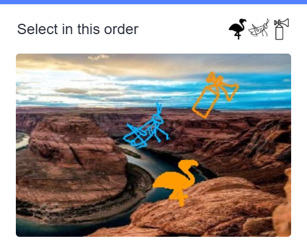

# GSXT Solver

**Version 0.3.0**

GSXT Solver is a PaddlePaddle-based image ordering toolkit for structured
click tasks. It takes one image, identifies the requested targets, and returns
the click points in order.

The project supports two workflows:

1. standalone Python API / CLI usage for saved images;
2. a local Chrome/Edge extension bridge for browser pages that display
   supported click-order challenges.

> Use this project only in environments where you have permission to automate
> or test the workflow. Respect the rules and terms of the systems you use.

## Supported scope

GSXT Solver is designed for images with:

- a prompt or target header near the top;
- three body targets;
- Chinese-character targets or icon-like targets;
- either:
  - a given-order instruction, where the header target order is read from left
    to right;
  - a semantic-order instruction, where Chinese characters are ordered by word
    or phrase semantics.

It is not a general OCR system, general object detector, or universal captcha
solver. It works best on layouts similar to the bundled fixtures and the
supported Geetest-style click challenge layout.

Example input:



## Features

- Detects character and icon-like target regions.
- Recognizes Chinese character targets.
- Recognizes and matches icon-like prompt targets to body targets.
- Distinguishes given-order tasks from semantic-order Chinese character tasks.
- Returns a stable standard result with ordered points.
- Provides a debug mode with full intermediate diagnostics.
- Provides a local browser-extension bridge for Chrome/Edge.

## Repository layout

```text
src/gsxt_solver/              Python package, CLI, model downloader, public API
Scripts/Gsxt/                 Paddle inference backend and development tools
Scripts/GJQYXYGS/             local browser-extension bridge and Flask service
tests/fixtures/               small packaged image fixtures
```

Generated outputs, logs, browser profiles, model weights, Paddle source clones,
and local environments are not part of the repository.

## Requirements

- Windows
- Python 3.10
- Git
- PaddlePaddle 3.2.x
- Chrome or Edge, only for the extension workflow

CPU inference is the simplest cross-machine setup. GPU inference requires a
PaddlePaddle build compatible with the local CUDA/CUDNN runtime.

## Installation

Clone the repository:

```powershell
git clone https://github.com/clz-nus-labs/Gsxt-Solver.git
cd Gsxt-Solver
```

Create an environment:

```powershell
conda create -n gsxt_solver python=3.10 -y
conda activate gsxt_solver
```

Install PaddlePaddle. CPU example:

```powershell
python -m pip install paddlepaddle==3.2.0 `
  -i https://www.paddlepaddle.org.cn/packages/stable/cpu/
```

Install the package:

```powershell
python -m pip install -e ".[inference]"
```

Install the required PaddleDetection and PaddleOCR source dependencies:

```powershell
powershell -ExecutionPolicy Bypass `
  -File .\Scripts\Gsxt\training\setup_paddledetection_repo.ps1 `
  -EnvName gsxt_solver `
  -DirectPython

powershell -ExecutionPolicy Bypass `
  -File .\Scripts\Gsxt\training\setup_paddleocr_repo.ps1 `
  -EnvName gsxt_solver `
  -DirectPython
```

If the environment is not currently activated, omit `-DirectPython`; the setup
scripts will use `conda run -n gsxt_solver`.

## Download model weights

Model weights are distributed as GitHub Release assets, not stored directly in
the repository.

```powershell
gsxt-models `
  --destination .\dist\models\gsxt-models-v0.1.0 `
  --release-base-url https://github.com/clz-nus-labs/Gsxt-Solver/releases/download/models-v0.1.0
```

Expected directory:

```text
dist/models/gsxt-models-v0.1.0/
  det/
  rec/
  icon/
```

For public release assets, no token is required. For private release assets,
set `GH_TOKEN` or `GITHUB_TOKEN` before running `gsxt-models`.

## Standalone Python API

```python
from gsxt_solver import Solver

solver = Solver.from_bundle(
    project_root=".",
    model_dir="dist/models/gsxt-models-v0.1.0",
    use_gpu=False,
)

result = solver.solve("tests/fixtures/test10.png", mode="standard")
print(result)
```

Example standard result:

```json
{
  "schema_version": "1.0",
  "success": true,
  "image": "test10.png",
  "task": {
    "action": "explicit_order",
    "type": "icon"
  },
  "result": {
    "count": 3,
    "sequence": ["flamingo", "grasshopper", "air horn"],
    "points": [
      {"x": 285, "y": 303},
      {"x": 239, "y": 212},
      {"x": 363, "y": 156}
    ],
    "items": [
      {
        "index": 1,
        "type": "icon",
        "value": "flamingo",
        "center": {"x": 285, "y": 303},
        "bbox": {"left": 244, "top": 262, "right": 327, "bottom": 344}
      }
    ]
  }
}
```

Standard mode returns only the public schema and does not save files by default.
To save files:

```python
result = solver.solve(
    "tests/fixtures/test10.png",
    mode="standard",
    output_dir="runs/example",
    save_result=True,
    save_visual=True,
)
```

Debug mode returns full diagnostics and saves debug files by default:

```python
debug_result = solver.solve(
    "tests/fixtures/test10.png",
    mode="debug",
    output_dir="runs/example-debug",
)
```

## Command-line usage

Standard mode:

```powershell
gsxt-solve .\tests\fixtures\test10.png `
  --project-root . `
  --model-dir .\dist\models\gsxt-models-v0.1.0 `
  --mode standard `
  --cpu
```

Debug mode:

```powershell
gsxt-solve .\tests\fixtures\test10.png `
  --project-root . `
  --model-dir .\dist\models\gsxt-models-v0.1.0 `
  --mode debug `
  --output-dir .\runs\test10-debug `
  --cpu
```

Common options:

```text
--cpu                 Run on CPU.
--mode standard       Return compact public output.
--mode debug          Return full diagnostic output.
--target-order TEXT   Provide a manual order.
--save-result         Save result.json in standard mode.
--save-visual         Save an annotated image in standard mode.
```

## Browser extension workflow

The local browser workflow uses the extension plus a Python service:

```text
Chrome/Edge page
  -> unpacked extension captures the challenge image
  -> POST http://127.0.0.1:7755/solve
  -> local GSXT Solver service returns ordered points
  -> extension clicks points and confirms
```

Install extension dependencies:

```powershell
python -m pip install -r .\Scripts\GJQYXYGS\requirements.txt
```

Start the local service from the repository root:

```powershell
python .\Scripts\GJQYXYGS\server.py
```

Expected output:

```text
GSXT Solver local service started
Listening: http://127.0.0.1:7755
Endpoint: POST /solve with image_base64
```

Load the extension:

1. open `chrome://extensions/` or `edge://extensions/`;
2. enable Developer mode;
3. click **Load unpacked**;
4. select `Scripts/GJQYXYGS/edge_extension`;
5. reload the target page.

Use the **GSXT assistant** panel added by the extension. If automatic solving
fails, complete the challenge manually; the workflow can continue afterwards.

More extension-specific details are in:

[Scripts/GJQYXYGS/README.md](Scripts/GJQYXYGS/README.md)

## Test after installation

Run one fixture through the CLI:

```powershell
gsxt-solve .\tests\fixtures\test10.png `
  --project-root . `
  --model-dir .\dist\models\gsxt-models-v0.1.0 `
  --mode standard `
  --cpu
```

Run the packaged fixture suite:

```powershell
gsxt-test-suite `
  --project-root . `
  --model-dir .\dist\models\gsxt-models-v0.1.0 `
  --fixtures .\tests\fixtures `
  --output-dir .\runs\test-suite `
  --cpu
```

Check the extension service:

```powershell
python .\Scripts\GJQYXYGS\server.py
```

## Troubleshooting

| Symptom | Check |
| --- | --- |
| `ModuleNotFoundError: paddle` | Install PaddlePaddle in the active environment. |
| `PaddleDetection` or `PaddleOCR` missing | Run the setup scripts under `Scripts/Gsxt/training`. |
| model file not found | Run `gsxt-models` and check `dist/models/gsxt-models-v0.1.0`. |
| extension cannot reach service | Confirm `python .\Scripts\GJQYXYGS\server.py` is running. |
| extension update did not take effect | Reload the unpacked extension and restart `server.py`. |
| GPU runtime warning | Use CPU first or install a compatible Paddle/CUDA/CUDNN stack. |

## License

This project is licensed under the terms in [LICENSE](LICENSE).
